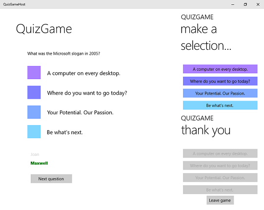

# QuizGame sample

**QuizGame** is a Universal Windows Platform (UWP) app sample that explores the benefits of running the same app on multiple devices in direct communication with one-another.

The UWP enables apps to run on a wide variety of devices and adapt to the available capabilities. Apps that use networking capabilities can put these devices in simultaneous contact to create the effect of a single app instance spanning several devices at once.

QuizGame implements this scenario to enable a pub-style trivia game. Questions appear on a large screen while members of the audience answer the questions on their phones and tablets. A quiz master can advance the game to additional questions and display the score at the end.

## Features

**Note:** Features in this app are subject to change.

QuizGame demonstrates:

* Peer-to-peer communication using UDP multicast and TCP; see the [P2PHelper](P2PHelper) project.
* A UWP app targeting the Universal device family and therefore capable of running on large and small screens.
* C# and XAML using the MVVM design pattern. For more info, see the [architecture notes](architecture.md).

## Universal Windows Platform development

This sample requires Visual Studio 2015 and the Windows Software Development Kit (SDK) for Windows 10.

[Get a free copy of Visual Studio 2015 Community Edition with support for building Universal Windows apps](http://go.microsoft.com/fwlink/?LinkID=280676)

Additionally, to be informed of the latest updates to Windows and the development tools, join the [Windows Insider Program](https://insider.windows.com/ "Become a Windows Insider").

## Running the sample

The default project is QuizGameHost and you can Start Debugging (F5) or Start Without Debugging (Ctrl+F5) to try it out. The app will run in the emulator or on physical devices. When running QuizGameClient please ensure that QuizGameHost is not already running.

**Note:** The platform target currently defaults to ARM, so be sure to change that to x64 or x86 if you want to test on a non-ARM device.

QuizGameHost is in local test mode by default (the conditional compilation symbol LOCALTESTMODEON is defined in the project's build properties). To turn off local test mode you can change LOCALTESTMODEON to LOCALTESTMODEOFF.

When local test mode is off, run the client and host apps on separate devices to play the game more realistically. Be sure to set the target platform and startup project as appropriate before you deploy.

**Note:** This sample assumes your network is configured to send and receive custom UDP group multicast packets (most home networks are, although your work network may not be). The sample also sends and receives TCP packets.

